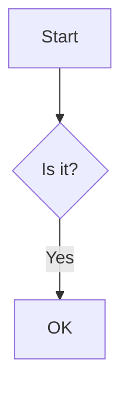

# Heading one

Intro with a [[target]] link, an [[target|aliased link]], a [[target#Section A|header link]],
a [[second#^blk1|block link]], an [external link](https://example.com/path?q=1), a
[relative link](./target), a [mailto](mailto:a@example.com) and an #inline-tag.

Arrows -> and => and <- here. ==highlighted text== and `inline code` and **bold** _em_ ~~del~~.

H~2~O is not GFM; <sub>sub</sub> <sup>sup</sup> <kbd>Ctrl</kbd> <abbr title="x">abbr</abbr>.

## Callouts

> [!note]
> A plain note.

> [!warning] Custom title with **bold** and [[target]]
> Body line one.
>
> Body paragraph two.

> [!tip]- Collapsed tip
> Hidden body.

> [!faq]+ Expanded question
> Body.

> [!my-custom-type|meta] Custom type
> Body.

> A normal quote.

## Embeds

![[target]]

![[second#^blk1]]

![[picture.png|Alt text|100x50]]

![[picture.png]]

![[doc.pdf]]

![[clip.mp4]]

![[song.mp3]]


## Code

```ts title="example.ts" {2}
const a = 1
const b = "two"
function f(x: number) {
  return x * 2
}
```

```
plain block
```



## Math

Inline $e^{i\pi} + 1 = 0$ math.

$$
\int_0^\infty e^{-x^2} dx = \frac{\sqrt{\pi}}{2}
$$

## Footnotes

Text with a footnote[^1] and another[^note].

[^1]: The first footnote.
[^note]: A named footnote with [[target]].

## Tables and lists

| Left | Center | Right |
| :--- | :----: | ----: |
| a    | [[target]] | c |

- [ ] open task
- [x] done task
- nested
  1. one
  2. two

<details>
<summary>Summary text</summary>

Details body.

</details>

<div align="center">centered div</div>


---

Term with line break  
next line.
